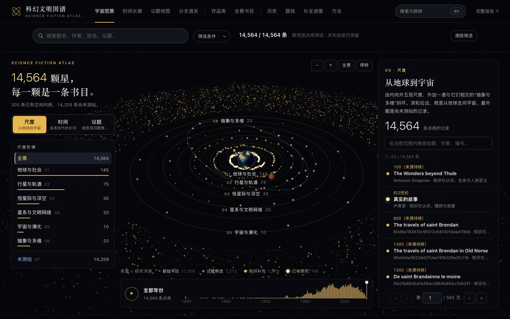
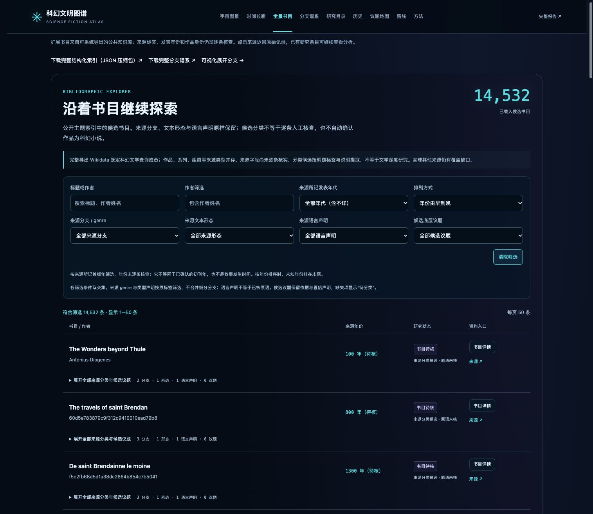

# 科幻探索 · 统一作品底库

公开网站：[科幻文明图谱](https://science-fiction-civilization-atlas.ouchangkun.chatgpt.site/)

网站现在以完整来源查询的 14,532 条书目实体为基础，168 条已有研究通过可复核链接附着为研究层。未可靠链接的研究条目独立保留。所有主要视图、组合筛选、作品详情与比较共用统一作品身份；缺少议题、年份、故事跨度或空间证据时明确保留未知。

统一数据模型与字段边界见 [统一架构](docs/unified-architecture.md)，实体合并依据见 [实体链接](docs/entity-linking.md)。这完成了当前来源的全量使用，全球全量书目仍受来源覆盖限制；[覆盖来源与缺口](docs/coverage-sources.md) 列出尚未接入的数据库。

**议题浏览**：议题地图显示当前筛选范围的作品分析、标签候选与分析缺口。可按细分问题精确筛选，点击作品查看具体问题及情节依据；相近细分标签暂时分别保留。全站搜索包括分析正文与依据，分享链接保留年代、细分议题和分析状态。

**补全进度**：所有14,564条统一实体均逐字段登记缺口与核对状态。熟悉作品新增知识标为待独立核对；Open Library定向书目对照保留原字段、对应依据、主题词候选和日期差异。新增全站“已有知识补充”“有缺失”“部分书目对应”“日期差异”“身份或版本待核”及具体缺失字段筛选。当前数量以 `research/canonical-universe-metadata.json` 为准，方法见 [补全与核对](docs/completion-methodology.md) 和 [基线审计](docs/audit-methodology.md)。

**全站分类持续演进**：议题、分支、叙事、时空、科学机制、现实关联、作品形式和历史脉络均可依据新材料新增、细分或交叉。新方向保留逐作品依据与实际资料范围，先进入待比较队列；原分类、版本、选篇限定和待核状态继续保留。

**本次扩展（R90）**：八个分类维度已有49个可浏览入口；新增10类和28条限定成员关系，涵盖惩罚与生活目的、身体治理、读者参与、跨时权限、多世界连通、生命存档、现实经历转写及混合载体。另补充20条核心议题分析、202条空间信息，当前13,418条有核心分析、1,146条待补。新增资料仍标为待独立核对；选篇、目录和版本范围逐条保留，校验不会提升来源核验等级。

**持续研究队列**：全部统一身份有明确下一步；取得简介与已完成分析分开计数。阅读范围、月度资料获取与复现见 [持续补全](docs/continuous-issue-research.md)。

下载与归档：

- `research/canonical-universe.json.gz`：统一索引、研究层、旧 ID 别名和详细来源引用。
- `research/canonical-universe.csv.gz`：可查询的主要字段。
- `research/structured-bibliography.json.gz`：完整来源字段、关系、规则分类依据及关联实体。
- `dist/assets/research-links.json`：全部研究记录的实体链接与候选。
- `research/record-audit.json.gz`：全部条目的17字段基线审计，含完整原值和缺口。
- `research/completion-overlay.json.gz`：知识补充、外部对照及可追溯规则候选。
- `research/knowledge-existing.json`、`knowledge-additional.json`：逐字段已有知识及待核边界。
- `research/issues-before-1900.json`、`issues-1900-1979.json`、`issues-since-1980.json`：按年代整理的作品核心问题、细分议题及情节依据，均为知识补充待核。
- `research/issue-review-notes.json`：新增批次的交叉复查范围、具体修正与仍待核的题名/层级问题。
- `research/issue-analysis.json.gz`：全部已有核心问题分析的专用索引；`issue-completion-summary.json` 记录本轮新增与仍缺分析的数量。
- `research/issue-research-queue.json.gz`、`reading-materials.json.gz`：全量逐条研究任务及已取得资料的公开事实清单。
- `research/library-crosschecks.json.gz`、`external-source/openlibrary/`：全部定向书目对照与原始缓存。

`research/report.md`、`research/catalog.json`／`catalog.csv` 及 `research/source-notes/` 保留首轮 168 条研究的历史版本。它们用于追溯已有论述和版本判断，没有因扩库而改写成对全部来源作品的研究报告。当前网站的统一索引与字段覆盖，以统一模型、来源快照和实体链接说明为准。

从完整书目索引出发，沿着发表时间、文学空间、科幻分支和底层议题探索科幻文学。

**[浏览公开网站](https://science-fiction-civilization-atlas.ouchangkun.chatgpt.site/)**

网站提供可旋转和缩放的三维地球、行星、恒星际、星系与宇宙图景，发表时间长廊，可展开的分支谱系，结构化研究目录，扩展书目筛选与逐条来源。三维坐标是文学导航示意；已知空间与独立待分类档案分别展示，所有记录均可从全景侧栏检索和分页。

## 内容与覆盖

- **已有研究层：168 条记录**，包括 160 条科幻作品、5 条科幻前史、3 条混合与边界参照。每条保留书目、议题、分支、叙事跨度、科学前提、版本备注与资料来源；不是逐本全文细读。
- **来源底库：14,532 条索引记录**（14,534 个 Wikidata 科幻文学查询成员，2 条明确非虚构记录另存归档）。可重复获取的查询、来源字段、排除项及覆盖统计一并保存；它包含长短篇、系列、组篇等不同单位，并不等于全球全部科幻小说。
- **分类保持证据层次**：来源自己的细分标签原样保存；规则生成的议题与分支只作候选；没有证据的字段保留待核，不自动继承研究目录的结论。

详细边界见 [研究方法](docs/methodology.md)、[字段说明](docs/data-dictionary.md)、[来源覆盖](docs/coverage-sources.md) 与扩库的 `research/expanded-catalog-notes.json`。全量覆盖是按来源与范围逐步核对的工作，不以一个大数字宣告完成。

## 仓库结构

| 路径 | 内容 |
| --- | --- |
| `dist/` | 可直接托管的完整网站与本地资源，无需构建 |
| `dist/assets/catalog.json` | 168 条研究目录 |
| `dist/assets/bibliography.json` | 完整索引分片清单与覆盖元数据 |
| `research/structured-bibliography.json.gz` | 所有记录的完整结构化字段与候选分类依据 |
| `dist/assets/bibliography-full.json.gz` | 上述完整 JSON 的无损压缩下载 |
| `dist/assets/bibliography-details/` | 按需读取的完整详情分片，避免初始加载全部字段 |
| `dist/assets/genre-hierarchy.json` | 454 个原始分支标签及其 1,176 个层级节点 |
| `dist/assets/spatial.json` | 空间航区、逐条依据与确定性 |
| `research/` | Markdown 报告、CSV/JSON、扩库来源元数据与查询记录 |
| `research/source-notes/` | 初始研究记录与工作笔记，最终修订以 `catalog.json` 为准 |
| `scripts/` | 数据验证、索引获取与候选分类脚本 |
| `docs/` | 方法、字段、覆盖、素材署名与网站预览 |

## 本地浏览

使用任何静态 HTTP 服务托管 `dist/`，例如：

```sh
python3 -m http.server 8787 --directory dist
```

打开 `http://localhost:8787/`。使用 HTTP 服务可正常加载 JSON 与 JavaScript 模块。

```sh
node scripts/validate.mjs
node scripts/validate-unified.mjs
node scripts/validate-completion.mjs
node scripts/validate-issues.mjs
node scripts/validate-reading-queue.mjs
```

无需安装前端依赖。Three.js 的固定版本和地球纹理已放入仓库。报告保留独立的阅读页面。

## 参与补充

欢迎通过 Issue 或 Pull Request 提交遗漏作品、来源、版本纠错或分类依据。请提供可核查的作者、题名、文本形态、初刊/单行本口径和链接。系列、单卷、单篇、译本及重版应保留关系，避免以题名相似进行错误合并。候选议题的修订应保留原始证据与修改理由。

## 许可与署名

网站代码使用 [MIT](LICENSE)。本项目撰写的研究文字与人工分类使用 [CC BY 4.0](LICENSE-DATA.md)。Wikidata 数据适用 CC0；Three.js 与 NASA 地球纹理依其各自许可和使用指引，详见 [署名说明](docs/attribution.md)。这些许可不包含原小说正文、书封及外部网页，也不改变原作者的权利。

## 复现与验证

详见 [复现说明](docs/reproduction.md)。验证覆盖原来源完整性、统一身份、补全字段状态、知识与源数据保留、外部粒度、未知筛选及下载一致性；原始缓存通过SHA256及离线重建核对。浏览器核验三维导航、年份联动、分支跳转、全量与候选议题筛选、补全进度、按需详情；手机布局也已检查。




